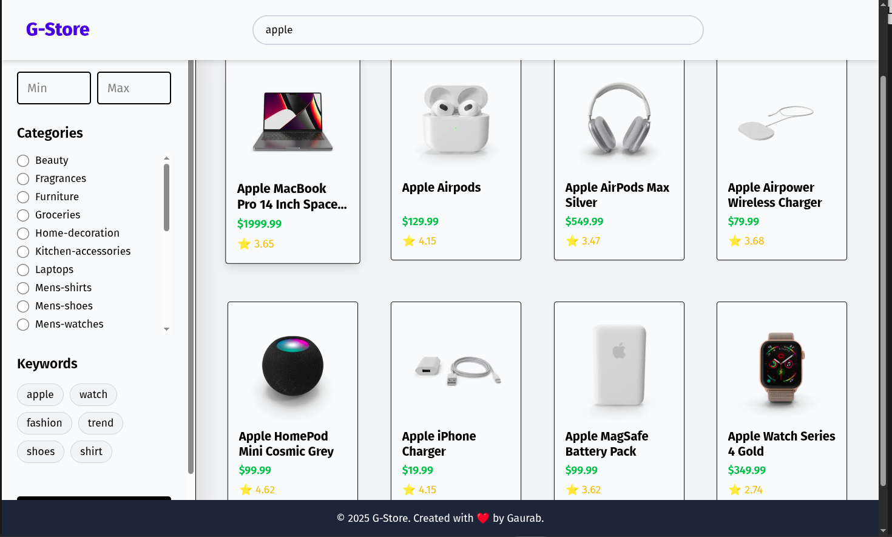
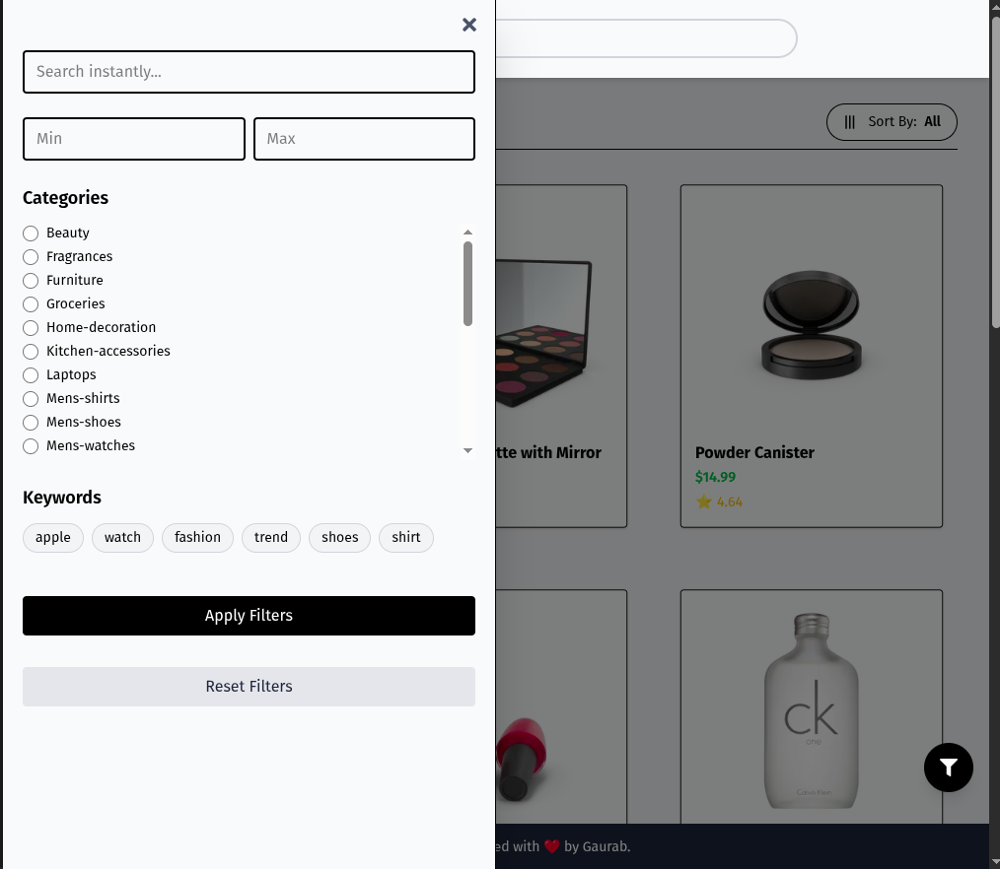

# G-Store - React E-Commerce Frontend App

G-Store is a responsive e-commerce application built with **React**, **TypeScript**, and **Tailwind CSS**. It features product browsing, filtering, sorting, pagination, and a mobile-friendly sidebar.

---

## Features

- **Responsive Layout**: Works on mobile, tablet, and desktop screens.  
- **Product Listing**: Displays products with images, price, rating, and title.  
- **Filtering Sidebar**:
  - Filter by **Category**.
  - Filter by **Price Range**.
  - Filter by **Keywords**.
- **Live Search**: Search products instantly by name.  
- **Sorting Options**: Sort by **Default**, **Cheap**, **Expensive**, and **Popular**.  
- **Pagination**: Navigate through product pages with smooth scrolling.  
- **Floating Mobile Filter Button**: Easily open/close filter sidebar on mobile.  
- **Local JSON Data**: Products loaded from a local `products.json` file to avoid API dependency.  

---

## Site sample View

![!\[alt text\]\[def\]](<images/Price based search.png>)

## Check it live
